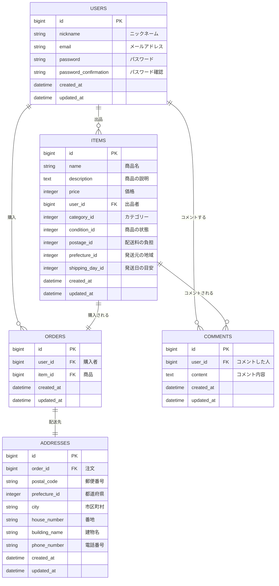

```mermaid
erDiagram
    USERS ||--o{ ITEMS : "出品"
    USERS ||--o{ ORDERS : "購入"
    USERS ||--o{ COMMENTS : "コメントする"

    ITEMS ||--|| ORDERS : "購入される"
    ITEMS ||--o{ COMMENTS : "コメントされる"

    ORDERS ||--|| ADDRESSES : "配送先"

    USERS {
        bigint id PK
        string nickname "ニックネーム"
        string email "メールアドレス"
        string password "パスワード"
        string password_confirmation "パスワード確認"
        datetime created_at
        datetime updated_at
    }

    ITEMS {
        bigint id PK
        string name "商品名"
        text description "商品の説明"
        integer price "価格"
        bigint user_id FK "出品者"
        integer category_id "カテゴリー"
        integer condition_id "商品の状態"
        integer postage_id "配送料の負担"
        integer prefecture_id "発送元の地域"
        integer shipping_day_id "発送日の目安"
        datetime created_at
        datetime updated_at
    }

    ORDERS {
        bigint id PK
        bigint user_id FK "購入者"
        bigint item_id FK "商品"
        datetime created_at
        datetime updated_at
    }

    ADDRESSES {
        bigint id PK
        bigint order_id FK "注文"
        string postal_code "郵便番号"
        integer prefecture_id "都道府県"
        string city "市区町村"
        string house_number "番地"
        string building_name "建物名"
        string phone_number "電話番号"
        datetime created_at
        datetime updated_at
    }

    COMMENTS {
        bigint id PK
        bigint user_id FK "コメントした人"
        text content "コメント内容"
        datetime created_at
        datetime updated_at
    }
```